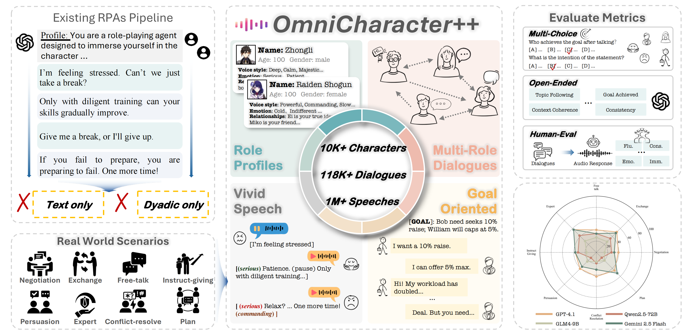
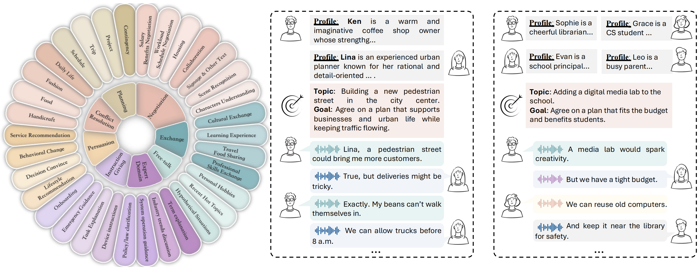
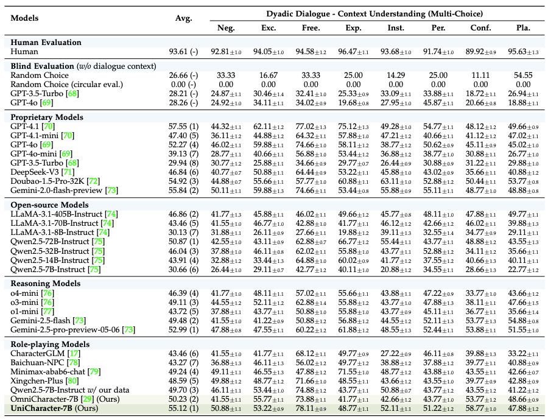
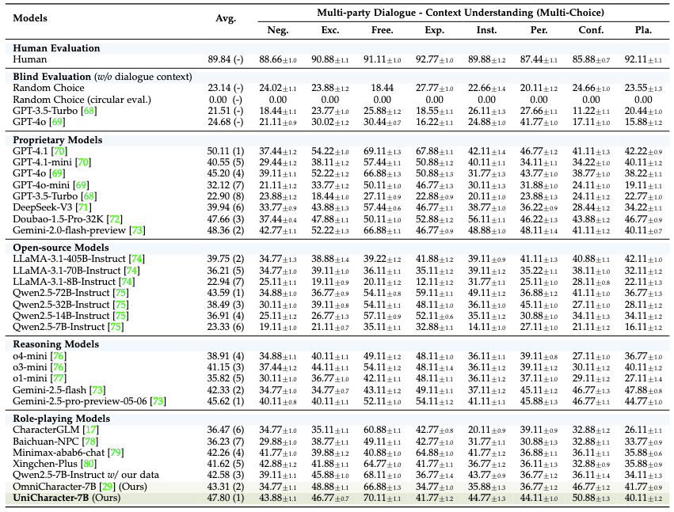

# OmniCharacter++: Towards Comprehensive Benchmark for Realistic Role-Playing Agents
> OmniCharacter++ evaluates the boundaries of today’s role-playing and character-aligned models on role-consistent multimodal interaction.
> It benchmarks 8 diverse topics with 31 subfields, _e.g._, negotiation, exchange, daily life, covering 10k+ characters, 118K dialogue samples, and 1M speech annotations.

[]()
[]()
[](https://huggingface.co/datasets/haonanzhang/OmniCharacter-plus)


## 🔥 Update
> [10/04/2026] 🔥 We release the [models](https://huggingface.co/haonanzhang/OmniCharacter-plus) and [data](https://huggingface.co/datasets/haonanzhang/OmniCharacter-plus) for OmniCharacter++!

🚀 This repository is continuously being updated. The model weights and datasets are currently being organized and reviewed internally and will be released once the process is complete. Stay tuned for the latest progress!


## 🌟 Highlights of **OmniCharacter++**


| Dimension                    | Example Features                                            | Scale               |
| ---------------------------- | ----------------------------------------------------------- | ------------------- |
| **Multi-party Interaction**  | realistic open-world, topic-driven dialogues                | 118K+ dialogues     |
| **Character Diversity**      | games, fiction, public domains, internet culture            | 10K+ unique roles   |
| **Multi-modal Exchange**     | text–speech co-driven, emotional tones, varied styles       | 1M+ audio responses |
| **Comprehensive Evaluation** | context understanding, generation ability, human perception | 3-level pipeline    |

* **Large-scale benchmark**: first to support multi-party, multi-modal role-playing at scale
* **Expressive modalities**: natural speech synthesis with controllable emotions and speaking styles
* **Challenging setting**: state-of-the-art RPAs still struggle with realistic interactions
* **Plug-and-play evaluation**: unified scripts for automated metrics and human studies
* **Research advances**: baseline **UniCharacter** with emotion preference learning and role-contextual adaptation

## 🚀 Quick Start

```bash
# Clone the repo
git clone --recursive https://github.com/zchoi/OmniCharacter-plus
cd OmniCharacter-plus


# Create Conda env:
conda create -n omnicharacter-plus python=3.10 -y
conda activate omnicharacter-plus
pip install --upgrade pip  # enable PEP 660 support

# If you want to use UniCharacter, execute the following process
pip install -e ".[train]"
pip install -r requirements.txt

# Install Flash Attention 2 for training (https://github.com/Dao-AILab/flash-attention)
#   =>> If you run into difficulty, try `pip cache remove flash_attn` first
pip install packaging ninja
ninja --version; echo $?  # Verify Ninja --> should return exit code "0"
pip install "flash-attn" --no-build-isolation
```
## 📊 Statistics of OmniCharacter++
OmniCharacter++’s large-scale dataset spans multi-party, topic-driven conversations, expressive character role-playing, and text–speech co-driven interactions. It covers over 10K diverse characters from games, fiction, and public domains, engaging in 118K+ multi-turn dialogues with more than 1M synthesized audio responses that capture varied speaking styles and emotions. Together, these resources form a unified benchmark that comprehensively probes role consistency, contextual understanding, multimodal communication, and adaptive interaction in realistic open-world scenarios.




| Set   | Dialogue Type  | #Characters | Avg. Turns/Conv. | #Dialogues | #Speech Hours |
|-------|----------------|-------------|-----------------|------------|---------------|
| Train | Dyadic         | 10,277      | 10.00           | 88,474     | 2867.94       |
|       | Multi-Party    |             | 15.05           | 29,543     | 1051.66       |
| Test  | Dyadic         | 10          | 9.89            | 185        | 6.96          |
|       | Multi-Party    |             | 16.72           | 334        | 15.20         |
| **Total** | -          | 10,377     | 12.92               | 118,536    | 3941.76       |


## 🧪 Evaluation Protocol of OmniCharacter++

OmniCharacter++ evaluates multi-modal role-playing agents from three complementary perspectives:

1. **Context Understanding** – Assess the model’s comprehension of dialogue context and character intent through role-related question answering (multi-choice) via [Circular Evaluation Strategy](https://github.com/open-compass/MMBench).
2. **Generation Ability** – Evaluate textual response generation using four metrics: `Topic Following`, `Goal Success`, `Character Consistency`, `Dialogue Coherence`.
3. **Human Perception** – Human experts rate the synthesized speech for naturalness and fidelity across six dimensions: `Fluency`, `Consistency`, `Emotional Expression`, `Clarity`, `Appropriateness`, `Immersion`.

## 🏆 Experiments
> 💡 **Note:** The analysis below represents just a few highlights. For a more comprehensive breakdown, interactive charts, and detailed findings, please visit our [Project Page-Analysis](https://video-mme-v2.netlify.app/#analysis).

<p align="center">
    
</p>

> **Performance comparison with state-of-the-art models on OmniCharacter++ test set of dyadic dialogue (Context Understanding)**. The results are evaluated on the dyadic and multi-character conversation scenarios, under the setting of multi-choice QA. All models are tested based on the Circular Evaluation Strategy [36] for a more robust evaluation, alleviating the negative impact of noise and random prediction of models. Neg.: negotiation, Exc.: exchange, Free.: free-talk, Exp.: expert-domain, Inst.: instruction-giving, Per.: persuasion, Conf.: conflict-resolution, Pla: planning. The number in () indicates the ranks.

<p align="center">
    
</p>


> **Performance comparison with state-of-the-art models on OmniCharacter++ test set of multi-party dialogue (Context Understanding)**. The results are evaluated on the dyadic and multi-character conversation scenarios, under the setting of multi-choice QA. All models are tested based on the Circular Evaluation Strategy [36] for a more robust evaluation, alleviating the negative impact of noise and random prediction of models. Neg.: negotiation, Exc.: exchange, Free.: free-talk, Exp.: expert-domain, Inst.: instruction-giving, Per.: persuasion, Conf.: conflict-resolution, Pla: planning. The number in () indicates the ranks.

For more experimental details, please refer to our paper.

## 🔍 Model

Here are the pretrained weights and training data.

| Model            | Stage                     | Data Composition              | Audio Modality | Download |
|------------------|--------------------------|-------------------------------|----------------|----------|
| OmniCharacter++  | Stage1 (base LLM & Speech adapter)     | multi-character dialogues    |    ✗    | [ckpt](https://huggingface.co/haonanzhang/OmniCharacter-plus) |
| OmniCharacter++  | Stage2 (SpeechLLM & EPO) | multi-character dialogues |   ✓   | [ckpt](https://huggingface.co/haonanzhang/OmniCharacter-plus) |


## 📜 Citation

If you find our work helpful for your research, please consider citing our work.

```bibtex
@article{zhang2025omnicharacter++,
  title   = {OmniCharacter++: Towards Comprehensive Benchmark for Realistic Role-Playing Agents},
  author  = {Haonan Zhang},
  journal = {arXiv preprint arXiv:XXXX},
  year = {2025}
}
@inproceedings{zhang2025omnicharacter,
  title={Omnicharacter: Towards immersive role-playing agents with seamless speech-language personality interaction},
  author={Zhang, Haonan and Luo, Run and Liu, Xiong and Wu, Yuchuan and Lin, Ting-En and Zeng, Pengpeng and Qu, Qiang and Fang, Feiteng and Yang, Min and Gao, Lianli and others},
  booktitle={ACL (main)},
  pages={26318--26331},
  year={2025}
}
```


## 📄 License

* **Code** — MIT License
* **Data** — CC BY-NC 4.0 (non-commercial research only)  
