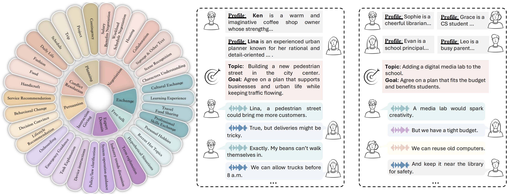

# OmniCharacter++: Towards Comprehensive Benchmark for Realistic Role-Playing Agents
> OmniCharacter++ evaluates the boundaries of today’s role-playing and character-aligned models on role-consistent multimodal interaction.
> It benchmarks 8 diverse topics with 31 subfields, _e.g._, negotiation, exchange, daily life, covering 10k+ characters, 118K dialogue samples, and 1M speech annotations.

[]()
[]()
[](https://huggingface.co/datasets/haonanzhang/OmniCharacter-plus)

> 🚀 This repository is continuously being updated, stay tuned for the latest progress!


## 🌟 Highlights of **OmniCharacter++**

| Dimension                    | Example Features                                            | Scale               |
| ---------------------------- | ----------------------------------------------------------- | ------------------- |
| **Multi-party Interaction**  | realistic open-world, topic-driven dialogues                | 118K+ dialogues     |
| **Character Diversity**      | games, fiction, public domains, internet culture            | 10K+ unique roles   |
| **Multi-modal Exchange**     | text–speech co-driven, emotional tones, varied styles       | 1M+ audio responses |
| **Comprehensive Evaluation** | context understanding, generation ability, human perception | 3-level pipeline    |

* **Large-scale benchmark**: first to support multi-party, multi-modal role-playing at scale
* **Expressive modalities**: natural speech synthesis with controllable emotions and speaking styles
* **Challenging setting**: state-of-the-art RPAs still struggle with realistic interactions
* **Plug-and-play evaluation**: unified scripts for automated metrics and human studies
* **Research advances**: baseline **UniCharacter** with emotion preference learning and role-contextual adaptation

## 🚀 Quick Start

```bash
# Clone the repo
git clone --recursive https://github.com/zchoi/OmniCharacter-plus
cd OmniCharacter-plus


# Create Conda env:
conda create -n omnicharacter-plus python=3.10 -y
conda activate omnicharacter-plus
pip install --upgrade pip  # enable PEP 660 support

# If you want to use UniCharacter, execute the following process
pip install -e ".[train]"
pip install -r requirements.txt

# Install Flash Attention 2 for training (https://github.com/Dao-AILab/flash-attention)
#   =>> If you run into difficulty, try `pip cache remove flash_attn` first
pip install packaging ninja
ninja --version; echo $?  # Verify Ninja --> should return exit code "0"
pip install "flash-attn" --no-build-isolation
```
## 📊 Statistics of OmniCharacter++
OmniCharacter++’s large-scale dataset spans multi-party, topic-driven conversations, expressive character role-playing, and text–speech co-driven interactions. It covers over 10K diverse characters from games, fiction, and public domains, engaging in 118K+ multi-turn dialogues with more than 1M synthesized audio responses that capture varied speaking styles and emotions. Together, these resources form a unified benchmark that comprehensively probes role consistency, contextual understanding, multimodal communication, and adaptive interaction in realistic open-world scenarios.




| Set   | Dialogue Type  | #Characters | Avg. Turns/Conv. | #Dialogues | #Speech Hours |
|-------|----------------|-------------|-----------------|------------|---------------|
| Train | Dyadic         | 10,277      | 10.00           | 88,474     | 2867.94       |
|       | Multi-Party    |             | 15.05           | 29,543     | 1051.66       |
| Test  | Dyadic         | 10          | 9.89            | 185        | 6.96          |
|       | Multi-Party    |             | 16.72           | 334        | 15.20         |
| **Total** | -          | 10,377     | 12.92               | 118,536    | 3941.76       |


## 🧪 Evaluation Protocol of OmniCharacter++

OmniCharacter++ evaluates multi-modal role-playing agents from three complementary perspectives:

1. **Context Understanding** – Assess the model’s comprehension of dialogue context and character intent through role-related question answering (multi-choice) via [Circular Evaluation Strategy](https://github.com/open-compass/MMBench).
2. **Generation Ability** – Evaluate textual response generation using four metrics: `Topic Following`, `Goal Success`, `Character Consistency`, `Dialogue Coherence`.
3. **Human Perception** – Human experts rate the synthesized speech for naturalness and fidelity across six dimensions: `Fluency`, `Consistency`, `Emotional Expression`, `Clarity`, `Appropriateness`, `Immersion`.


## 📜 Citation

If you find **OmniCharacter++** useful, please cite:

```bibtex
@article{omnispatial25,
  title   = {OmniCharacter++: Towards Comprehensive Benchmark for Realistic Role-Playing Agents},
  author  = {Haonan Zhang},
  journal = {arXiv preprint arXiv:XXXX},
  year = {2025}
}
```

## 📄 License

* **Code** — MIT License
* **Data** — CC BY-NC 4.0 (non-commercial research only)  
